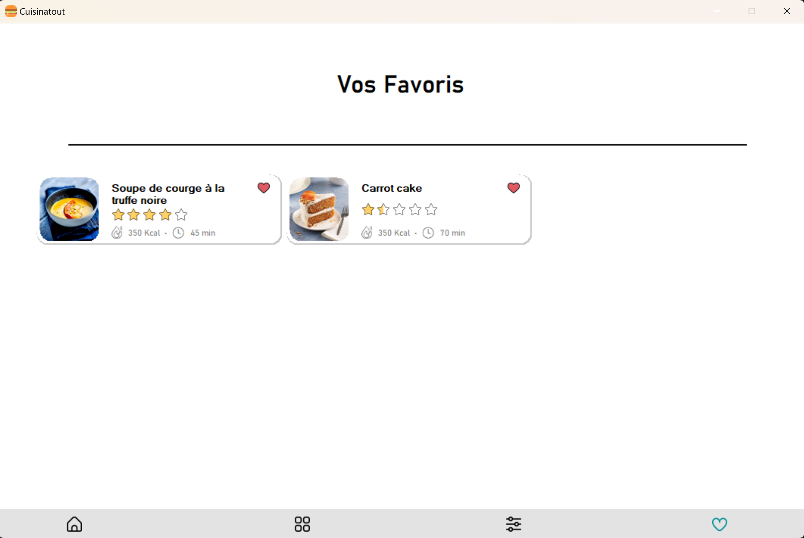
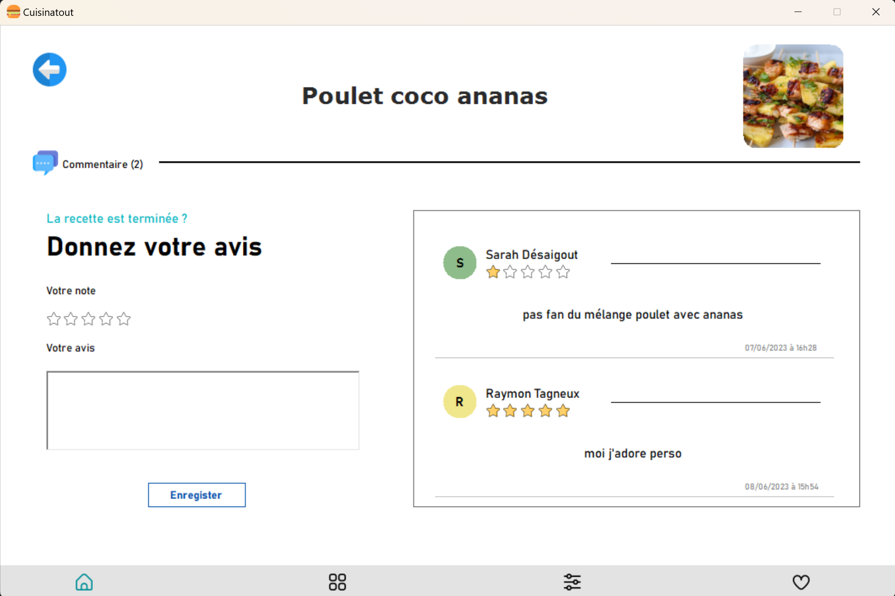

# Projet - Application culinaire

## Introduction
- Projet réaliser dans le cadre d’un projet de l’iut
- codé avec C#, Windows Form et .net
- librairies utilisées : .net
- L’application est connectée à une base de donnée (SQL) en local

## Comment installer
- Installer tous les fichiers
- Exécuter le fichier qui se trouve dans SAE_D21/bin/debug/SAE_D21
- Ou installé visual studio 2022 et ouvrer/compiler le projet

## Visuel
### Page d'accueil

### Page d'une recette

### Selection des ingredients

### Résultat

### Connection a un compte

### Section Favoris

### Section commentaire

